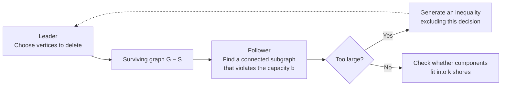
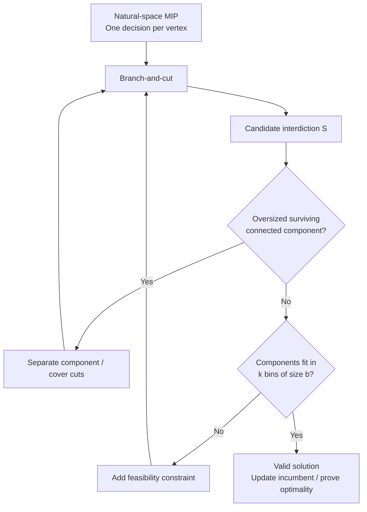
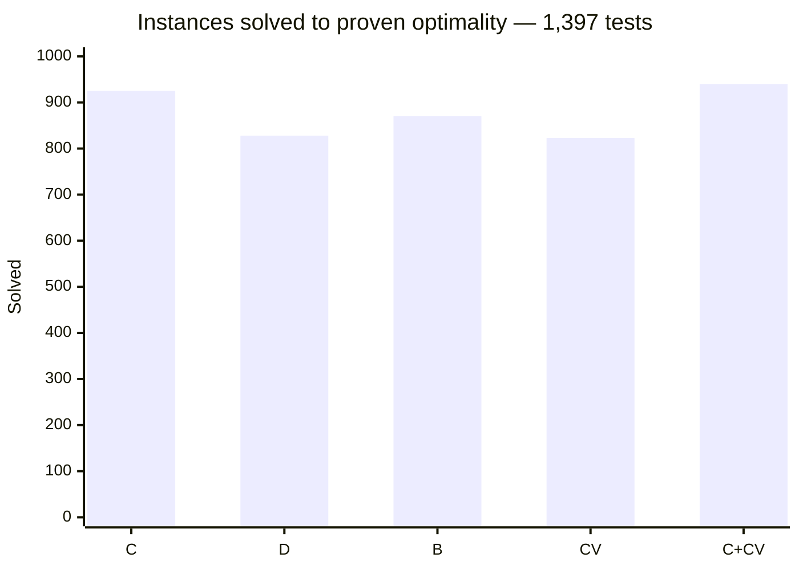

# When deleting vertices becomes a two-player game

### Casting Light on the Hidden Bilevel Combinatorial Structure of the Capacitated Vertex Separator Problem

**Fabio Furini · Ivana Ljubić · Enrico Malaguti · Paolo Paronuzzi**  
*Operations Research* **70(4)**, 2399–2420 (2022) · [Journal / DOI](https://doi.org/10.1287/opre.2021.2110) · [Full PDF](https://fabiofurini.github.io/papers/J36_2022_OPRE_casting-light-hidden-bilevel-combinatorial-structure.pdf) · [Implementation](https://github.com/paoloparonuzzi/CVSP)

---

> **The surprising idea:** A problem that looks like graph partitioning has a useful *hidden bilevel structure*. Once we let a second player search the surviving network for a forbidden large connected subgraph, we can construct strong inequalities directly in the vertex-removal variables—and solve difficult instances without explicitly assigning every vertex to a shore.

**Jump to:** [The problem](#1-the-problem-in-one-picture) · [Bilevel insight](#2-the-hidden-game) · [The inequalities](#3-what-the-game-gives-us) · [Results](#5-the-numbers-that-matter) · [Read the paper](#7-where-to-go-next)

## 1. The problem, in one picture

Suppose we must protect a network against an attack capable of spreading along its edges. We can protect (or remove) some vertices, but want to protect as **few as possible**. Once those vertices are excluded, the network must break into **at most `k` groups**, each containing no more than **`b` vertices**, with no edge connecting distinct groups.

Formally, for an undirected graph `G=(V,E)`, we partition `V` into a separator `S` and shores `V₁,…,Vₖ`, allowing empty shores, minimizing `|S|` subject to

- `|Vᵢ| ≤ b` for every shore;
- no edge of `E` joins vertices in different shores.

**Actual introductory example from the paper (Figure 1):** 10 vertices, 13 edges, `k=b=3`. An optimal separator is `S={v₈,v₉}`, leaving shores `{v₁,v₂,v₇}`, `{v₃,v₄}` and `{v₅,v₆,v₁₀}`.

| Removed vertices | Shore 1 | Shore 2 | Shore 3 |
|:--|:--|:--|:--|
| **v₈, v₉** | v₁, v₂, v₇ | v₃, v₄ | v₅, v₆, v₁₀ |
| **2 vertices** | 3 vertices | 2 vertices | 3 vertices |

This is **not simply** the requirement that every *connected component* have size at most `b`. Components must also be **packable into at most `k` shores of capacity `b`**. That last condition explains why a bin-packing feasibility test appears in the exact algorithm.

The same mathematical structure occurs in **block decomposition of matrices**, where the shores represent separate blocks assigned to parallel processing units.

## 2. The hidden game

Instead of directly searching for a partition, imagine an adversarial exchange:

*Conceptual diagram created for this reading guide; not a reproduction of a figure from the article.*

The **leader** decides which vertices to interdict; the **follower** exploits the remaining graph. The follower's task exposes precisely why a proposed interdiction decision fails.

**The key payoff is mathematical, not just interpretive:** the follower's combinatorial structure lets us generate valid inequalities involving the **natural vertex-deletion variables**. We can build a branch-and-cut algorithm around those variables rather than carry the full shore assignment throughout the search.

## 3. What the game gives us

The paper develops and compares several ways of translating a surviving *oversized* connected structure into a cutting plane.

| Family | Main intuition | Role in the study |
|:--|:--|:--|
| **Component inequalities (C)** | A large connected structure must be broken by vertex deletions; coefficients reflect how deleting individual vertices disrupts it | Best single-family configuration in the main experiments |
| **Benders inequalities (B)** | Obtain cuts through a dual-based convexification of the follower's response | Conceptually natural but weaker in an important comparison |
| **Degree inequalities (D)** | Exploit tree/degree information to force enough interdiction | Alternative tree-based strengthening |
| **Cover inequalities (CV)** | Exploit graph structure to prohibit incompatible surviving configurations | Particularly useful **together with** component cuts |

The distinction between these families is **not cosmetic**. The paper establishes dominance relationships, including a result showing that the relevant **Benders inequalities are dominated by component inequalities** when associated with the same connected subgraph and spanning tree (Proposition 8). That theoretical observation helps explain the computational comparison.

The branch-and-cut includes further, polynomially many strengthening constraints (notably **star inequalities and precedence constraints**) and checks the shore-capacity **bin-packing** condition as necessary.

**An algorithmic detail worth noticing:** the tested separation routines for these graph-derived families are polynomial-time at **integer candidate solutions**. Separation at fractional LP points was also investigated for some families, but did not improve overall performance in the reported experiments. The method is therefore not just a generic “add all possible cuts” approach: it makes deliberate choices about *when* separation is worth its cost.

## 4. From a modelling idea to an exact solver

*Simplified methodological diagram. For exact formulations, coefficients, and separation algorithms, see Sections 3–4 of the paper.*

Two checks must work together: the **graph check**, to prevent oversized connected components, and the **packing check**, to ensure the components can actually be assigned to the available shores.

## 5. The numbers that matter

### Which cut family wins?

**Table 1 of the paper:** 1,397 benchmark instances, **30-minute time limit**. Numbers are instances solved to *proven optimality*.

| Branch-and-cut variant | Solved / 1,397 |
|:--|--:|
| Component (**C**) | 925 |
| Degree (**D**) | 828 |
| Benders (**B**) | 870 |
| Cover (**CV**) | 823 |
| **Component + Cover (C+CV)** | **940** |

**Why this is interesting:** Component inequalities are strongest among the four *standalone* configurations. Yet combining them with cover inequalities closes **15 additional instances**. These two cut types capture complementary graph information.

### Can the method beat existing exact algorithms?

**Table 2 of the paper:** same 1,397 benchmark instances, comparing:

- **CPLEX:** direct solution of a compact formulation;
- **BP:** existing branch-and-price algorithm;
- **C+CV:** proposed branch-and-cut with component and cover cuts.

| Instance class | Total | CPLEX | BP | **C+CV** |
|:--|--:|--:|--:|--:|
| DIMACS | 296 | 124 | 164 | **182** |
| MIPLIB | 303 | 73 | 109 | **138** |
| Netlib | 436 | 237 | 351 | **354** |
| Random | 362 | 168 | **322** | 266 |
| **All classes** | **1,397** | **602** | **946** | **940** |

The conclusion is more informative than “our algorithm wins”:

- On **DIMACS**, the new method proves optimality for **18 more instances** than BP.
- On **MIPLIB**, the gain is **29 instances**.
- On **Netlib**, the methods are nearly tied.
- On **Random**, **BP is clearly better** (322 vs 266).
- Aggregated across all four groups, **BP solves 946 and C+CV solves 940**. Thus the methods are **complementary**, not universally ordered.

The breakdown by number of shores adds a second insight: the compact CPLEX approach can be attractive for **small `k`**, while the natural-space methods become much more competitive for **medium and large `k`**.

*Interpretation note:* these numbers use the paper's specific benchmark, computational platform and time limit; they are **not** claims about current solver versions.

### The related min–max model

The work goes beyond minimizing the number of deleted vertices. It also develops an extension in which an interdiction budget is given and one seeks to **minimize the largest surviving component**.

On the reported extension benchmark (**Table 3**, 564 instances), the dedicated branch-and-cut (**CC**) solves **290** instances, against **161** for the direct compact formulation (**CPX**) and **164** for the alternative formulation (**SIG**).

| Method | Solved / 564 |
|:--|--:|
| CPX | 161 |
| SIG | 164 |
| **CC** | **290** |

This result is a useful test of the paper's more general message: the modelling technique can transfer to a related, but different, network-protection objective.

## 6. What I would look at in the full paper

If you work on **MIP formulations**, focus on how the bilevel follower yields inequalities in a small, natural variable space. If you work on **separation**, compare the alternative tree-based cut coefficients and Proposition 8. If you work on **exact computation**, Table 1 is a useful case study in why stronger or more elaborate cuts do not automatically produce a faster solver; Table 2 shows where algorithmic complementarity matters.

For graph and network researchers, a particularly worthwhile question is: **what other graph modification problem could reveal a tractable follower whose reaction can be expressed as valid cuts?**

## 7. Where to go next

The guide highlights selected ideas and reported results; the complete technical development, proofs, figures, formulations, and detailed tables are in the paper.

**[Read the full author-version PDF](https://fabiofurini.github.io/papers/J36_2022_OPRE_casting-light-hidden-bilevel-combinatorial-structure.pdf)** · **[Published article](https://doi.org/10.1287/opre.2021.2110)** · **[Source code](https://github.com/paoloparonuzzi/CVSP)** · **[Other publications](https://fabiofurini.github.io/publications/)**

*Figures above are original explanatory diagrams, not extracted figures from the article. The reported numerical comparisons reproduce selected counts from Tables 1–3 of the manuscript.*
